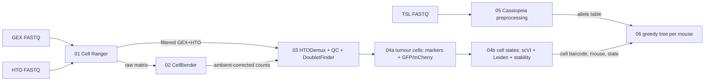

# HANDSOFF — single-cell lineage tracing in mouse prostate cancer

**From raw FASTQ to (1) tumour cell states and (2) a Cassiopeia greedy lineage tree, per mouse.**

Written for rotation students joining the tracing project (Shen lab, CUIMC). Maintainer: Zejian Wang.
Tutorial data: 2 Npp53 mice subsampled from 10x run MJZ019. Everything runs on the c2b2 HPC.

> **Data policy. Read this first.** This repository is **public**. It holds only scripts (`.py .R .sh .sbatch`) and
> documentation. **Never commit** FASTQs, count matrices, metadata tables, allele tables, character
> matrices, trees, cell-state labels, `.h5ad/.RDS/.loom` files, or figures. The `.gitignore` is a
> whitelist that blocks all of those, and you should never use `git add -f`. All data and outputs live on HPC under
> `${DEMO}` (read-only input) and your own `${WORK}` folder.

---

## 1 · The biology and the assay in five minutes

**Question.** How do prostate tumours evolve? Which cell states arise, which are inherited or plastic,
and which clones expand? And how does castration (± enzalutamide) redirect that route?

**Model.** Mouse prostate tumours (here **Npp53**: Pten + p53 loss) are grown from cells carrying a
**Cas9 lineage recorder** and fluorescent reporters (GFP, mCherry). Arms are `Intact`, `Castration`, and
`Castration + Enzalutamide`.

**Lineage recorder.** Each cell carries many integrated target sites. Each site has an
**intBC** (integration barcode, identifies the copy) and **3 Cas9 cut sites (r1, r2, r3)**. As the tumour
grows, Cas9 leaves random indels that are inherited by daughter cells. Cells that share indels share
ancestry, and that is what lets us rebuild a tree.

**One 10x run = three sequencing libraries from the same cells (same 16-bp cell barcode):**

| Library | Name pattern | What it measures | Tool |
|---|---|---|---|
| Gene expression (GEX) | `MJZ019` | transcriptome, including GFP / mCherry / Cas9 transgene "genes" | Cell Ranger |
| Hashtag (HTO) | `MJZ019F` | which mouse a cell came from (up to 6 mice pooled, TotalSeq-B B301–B306) | Cell Ranger → HTODemux |
| Lineage amplicon (TSL) | `MJZ19TSL` | recorder sequences (intBC + r1/r2/r3 indels), sequenced on Element AVITI | Cassiopeia |

The **cell barcode (16 bp)** is the key that links all three libraries. The TSL library has **no hashtag**, so
mouse identity comes from the GEX/HTO side.



---

## 2 · The tutorial dataset

The demo FASTQs were made by `00_make_demo_data/` from run **MJZ019**. They keep the reads of:

| Mouse | Hashtag | Arm | Cells kept |
|---|---|---|---|
| **JZ202** | B302 | Castration + Enzalutamide | ≤ 800 random HTO-singlet cells |
| **JZ204** | B304 | Castration | ≤ 800 random HTO-singlet cells |
| — | mixed | — | 300 doublet / negative barcodes, so demux has something to reject |
| — | — | — | 15,000 empty droplets, so CellBender can learn the ambient RNA |

Location on HPC (read-only for you): `/groups/ms3625_gp/zw2994/1-project/12-Jingbo/2-Tracing/teaching_demo_MJZ019/`

```
fastq/GEX/MJZ019sub_S1_L001_R{1,2}_001.fastq.gz    # 10x 3' v3 GEX
fastq/HTO/MJZ019Fsub_S1_L001_R{1,2}_001.fastq.gz   # hashtags
fastq/TSL/MJZ019TSLsub_R{1,2}.fastq.gz             # lineage amplicon
manifest.json                                      # how the subsample was made (seed 42)
```

If this folder does not exist yet, ask Zejian: it is created once with
`sbatch 00_make_demo_data/make_demo_data.sbatch`. You can also point `config/config.sh` at any
other run's FASTQs. The scripts only need the three FASTQ pairs plus the hashtag map in `config/hashtags.sh`.

Because the subsample keeps whole cells, every step behaves like the real data, only faster. The full
cohort (25 mice, ~21k tumour cells) runs through the same scripts with bigger resources.

### 2b · Alternative start: step 03 with the provided data folder (recommended first)

Zejian gives you a folder **`Rotation_tutorial_data/`** on a hard drive. It already contains the outputs of
steps 01, 02 and 05 for two full runs, so you begin at **demultiplexing and cell-type identification**:

| Run | Mice | What it teaches |
|---|---|---|
| **MJZ019** | JZ201–JZ205, Npp53, Castration ± Enzalutamide (5 hashtags) | the main tutorial run |
| **MJZ008** | JZ136 (Npp53), JZ137 + JZ138 (Np53Rb1), all Intact (3 hashtags) | a second run to repeat everything on your own |

Per run: Cell Ranger `filtered_feature_bc_matrix/` (GEX + hashtags) and `web_summary.html`, the CellBender
`*_cellbender_filtered.h5`, and **one allele table for the whole run** (`05_cassiopeia/<RUN>_allele_table.csv`).
Its `README.md` explains every file. Check the copy with `md5sum -c MD5SUMS.txt`. **This is unpublished
data: never upload it (GitHub, cloud drives, AI tools).**

1. Build the envs once: `bash envs/create_envs.sh seurat scvi cassiopeia`
2. In `config/config.sh`, fill in and uncomment **section 6 (OPTION B)**: `TUTORIAL_DATA`, `RUN`, `KEEP_SAMPLES`, `WORK`.
3. Run on your own machine (no SLURM needed, ~16–32 GB RAM):
   ```bash
   bash run_local_from_step03.sh          # 03 -> 04 -> 06, or one step: 03 | 04 | 04b | 06
   RES=0.7 bash run_local_from_step03.sh 04b   # re-run states at your chosen resolution
   ```
   On HPC use the step 03 / 04 / 06 sbatch files instead. For 5 mice, submit step 06 with `--array=0-4`.
4. Then read §4 for steps 03, 04 and 06. Later, do steps 01, 02 and 05 from FASTQs.

---

## 3 · Setup (once)

1. Get a c2b2 account in group `ms3625_gp` and log in: `ssh <uni>@hpc.c2b2.columbia.edu`.
2. Clone the repo into your home or group folder:
   ```bash
   git clone https://github.com/ZejianCUMC/Mouse_PCa_Tracing.git
   cd Mouse_PCa_Tracing
   ```
3. Edit **one line** in `config/config.sh`: set `WORK` to a folder you own. All outputs go there.
4. Always submit jobs **from the repository root**. The scripts `source config/config.sh` and write
   logs to `logs/`.

Software is already installed in the lab's shared envs (`/groups/ms3625_gp/zw2994/mamba/envs/`). Nothing needs installing.

| Step | Env / tool | Language |
|---|---|---|
| 01 | Cell Ranger 10.0.0, reference `GRCm39_tracing` (GRCm39 + transgenes) | — |
| 02 | `cellbender` (GPU) | — |
| 03 | `ST` (Seurat 5, DoubletFinder, DropletUtils) | R |
| 04 | `scvi` (scanpy 1.11, scvi-tools 1.2) | Python |
| 05, 06 | `cassiopeia_env` (Cassiopeia 2.1) | Python |

**Your own copy of the environments** (on your own Linux machine or HPC space). Specs are in `envs/`, one
JSON per environment, with versions matched to the lab envs above:

```bash
bash envs/create_envs.sh              # builds tracing_cellbender, tracing_seurat, tracing_scvi, tracing_cassiopeia
bash envs/create_envs.sh scvi         # or just one
```

| Spec | Replaces lab env | Used in |
|---|---|---|
| `envs/tracing_cellbender.json` | `cellbender` (CellBender 0.3.0) | 02 |
| `envs/tracing_seurat.json` (+ DoubletFinder from GitHub, added by the script) | `ST` | 03 |
| `envs/tracing_scvi.json` | `scvi` | 04 |
| `envs/tracing_cassiopeia.json` (Cassiopeia from GitHub, pinned commit) | `cassiopeia_env` | 05, 06 |

Cell Ranger is not a conda package: download 10.0.0 from 10x Genomics. The `GRCm39_tracing` genome and
the `refOct1.fa` recorder reference are lab resources on c2b2 and are not in this public repo. To use your
own envs, change `ENVS` in `config/config.sh` and the env folder name on the `PATH` line of each sbatch.

**HPC etiquette.** Never run analysis on the login node (it is for editing, `sbatch`, `squeue`, `ls` only).
Request the CPUs your job actually uses. Check a job within 5 minutes of it starting (`squeue -u $USER`,
`tail logs/...`); if it finishes suspiciously fast, it probably failed. **Ask Zejian before submitting
anything larger than these demo jobs**, because the lab pays per CPU-hour.

---

## 4 · Run it

`commands.sh` has every submit command. It can chain everything with `--dependency=afterok`, but the
first time, run the steps **one by one** and look at each output before moving on.

### 01 · Cell Ranger count: FASTQ → count matrices
```bash
sbatch 01_cellranger/run_cellranger.sbatch
```
- Writes `library.csv` (which FASTQ folder is GEX vs Antibody Capture) and `feature_ref.csv` (the hashtag
  sequences) into `${WORK}/metadata/` at run time.
- Output: `${WORK}/01_cellranger/MJZ019sub/outs/`
- **Check:** open `web_summary.html`. Look at estimated cells, median genes per cell, % reads in cells,
  and antibody reads per cell. In this subsample, "Estimated cells" should be roughly the number of cells kept.
- Rule: the feature reference must list **every** hashtag used in the pool.

### 02 · CellBender: remove ambient RNA
```bash
sbatch 02_cellbender/run_cellbender.sbatch      # GPU
```
- Input is the **raw** matrix (all droplets). Empty droplets show CellBender what "soup" looks like.
- Output: `${WORK}/02_cellbender/MJZ019sub_cellbender_filtered.h5`. This is the count matrix used downstream.
- **Check:** in `MJZ019sub_cellbender.pdf`, the training curve should converge, and cells should separate from empties.

### 03 · Demultiplex + QC + doublets
```bash
sbatch 03_demux_qc/run_demux_qc.sbatch
```
`demux_qc_doublets.R` does the following:
1. QC: `nFeature_RNA > 200`, `percent.mt < 10`.
2. **HTODemux** on CLR-normalised hashtag counts (`positive.quantile 0.85`), keeping Singlets. Two hashtags
   in one droplet mark a doublet from two mice.
3. Maps hashtag → mouse → arm (`hash_map.csv`, written by `config/hashtags.sh`) and keeps `KEEP_SAMPLES`.
4. Swaps in CellBender-corrected counts.
5. **DoubletFinder** per mouse. This catches doublets from the *same* mouse, which hashtags cannot see.
6. Exports `counts.mtx / genes.txt / barcodes.txt / cell_meta.csv` for Python.
- **Check:** `HTO_ridgeplot.png` (each hashtag should be bimodal), `HTODemux_calls.csv`, and
  `cell_funnel.csv` (how many cells survive each filter).

### 04 · Tumour cells and tumour cell states
```bash
sbatch 04_cell_states/run_cell_states.sbatch
```
**04a `04a_tumor_cells.py`: which cells are tumour?**
- scVI latent (30 dims). We use **no batch key**, because this is one 10x run. Never use mouse or treatment as a
  batch key: that would erase the biology you are studying.
- Leiden clustering (res 0.5), and each cluster is named by the argmax of canonical marker scores
  (luminal, basal, EMT, fibroblast, endothelial, immune ...).
- **Tumour = GFP > 0 AND mCherry > 0 AND not in a host cluster.** A host cluster has host-type markers
  *and* is mostly reporter-negative. Tumour mesenchymal cells can look fibroblast-like, but they carry the reporters.
- **Check:** `UMAP_all_reporters.png`, `UMAP_all_major_type.png`, and the printed table of reporter+ fraction per cluster.

**04b `04b_tumor_states.py`: which states exist among tumour cells?**
- New scVI on tumour cells only, then a Leiden sweep over resolutions 0.1–1.2.
- For each resolution it computes a **bootstrap** (80 % of cells, 20 runs): ARI, and per-cluster stability,
  where stability is the best Jaccard match of each cluster in the re-clustered subsample. The script
  suggests the finest resolution at which **every** cluster has median Jaccard ≥ 0.6.
- At the chosen resolution it runs Wilcoxon markers (`markers_res*.csv`), a dotplot, and a naming hint
  per cluster (z-scored signature scores: Luminal-AR, Luminal-Squamous, Basal, Partial-EMT, Mesenchymal,
  Cycling, Ionocyte ...).
- **You name the states.** Read `cluster_summary_res*.csv` (size, hint, top-10 markers) and decide. The
  hint is a starting point, not an answer. Then re-run at the resolution you defend:
  `sbatch --export=ALL,RES=0.7 04_cell_states/run_cell_states.sbatch`
- Output used by step 06: `cell_states.csv` (`cellBC, sample_id, treatment, cluster, state, exclude_from_tree`).
  Cycling and Ionocyte clusters are flagged `exclude_from_tree`. Cycling reflects cell-cycle phase, not
  lineage identity, and the lab's Npp53 trees are built without these cells.

### 05 · Cassiopeia preprocessing: TSL FASTQ → allele table
```bash
sbatch 05_cassiopeia/run_cassiopeia.sbatch       # can run in parallel with 01-04
```
Ten Cassiopeia steps. Each step saves a checkpoint, so a crashed job resumes where it stopped:

| # | Step | What happens |
|---|---|---|
| 1 | `convert_fastqs_to_unmapped_bam` | R1 = 16 bp cell barcode + 12 bp UMI; R2 = amplicon |
| 2 | `filter_bam` | drop low-quality reads (Q < 10) |
| 3 | `error_correct_cellbcs_to_whitelist` | snap cell barcodes to the 10x v3 whitelist |
| 4 | `collapse_umis` | reads → UMIs (molecules) |
| 5 | `resolve_umi_sequence` | one consensus sequence per UMI; cells need ≥ 10 UMIs |
| 6 | `align_sequences` | Smith-Waterman alignment to the recorder reference `refOct1.fa` |
| 7 | `call_alleles` | intBC = reference positions 20–34; indels at cut sites 112 / 166 / 220 → r1, r2, r3 |
| 8 | `error_correct_umis` | merge UMIs within 2 mismatches (memory-hungry on full libraries) |
| 9 | `filter_molecule_table` | remove low-support UMIs, bad intBCs, and allele-conflict doublets |
| 10 | `call_lineage_groups` | final **allele table** |

- Output: `${WORK}/05_cassiopeia/MJZ019TSLsub_allele_table.csv`, with columns
  `cellBC, intBC, allele, r1, r2, r3, lineageGrp, UMI, readCount`.
- How to read an allele: `CCGAA[113:3D]TGGCC` is a 3-bp deletion at position 113 (site r1).
  `[None]` means the site is uncut. Editing is **not saturated**: r3 is the least-edited site, so the
  recorder still has capacity.

### 06 · One greedy lineage tree per mouse
```bash
sbatch 06_greedy_tree/run_greedy_tree.sbatch     # array: one task per mouse
```
`build_greedy_tree.py`:
1. Joins the allele table to `cell_states.csv` on the 16-bp barcode, which gives mouse and state. It keeps only
   that mouse's tumour cells and drops `exclude_from_tree` cells.
2. Builds the **character matrix** with `convert_alleletable_to_character_matrix(allele_rep_thresh=0.99)`:
   cells × characters (intBC × site); `0` = uncut, `-1` = missing, `1..n` = indel states. Sites where one
   allele covers > 99 % of cells carry no information and are dropped.
3. Solves with **`VanillaGreedySolver`**, the lab's primary solver. It repeatedly splits cells on the
   most-shared mutation, which is fast and robust to missing data.
4. Writes `<SAMPLE>_tree_greedy.nwk`, `character_matrix.csv`, `leaf_states.csv`, `tree_qc.json`, and a PNG.
- **Check `tree_qc.json`:** cells with lineage vs tumour cells, fraction missing, per-site edit rates, and tree depth.
- Greedy trees have unit branch lengths and many polytomies (nodes with more than 2 children). That is expected.
- The array size must equal the number of mice in `KEEP_SAMPLES` (`--array=0-1` for 2 mice, `0-4` for 5).
- Robustness: `sbatch --export=ALL,SOLVER=nj 06_greedy_tree/run_greedy_tree.sbatch` (also `maxcut`,
  `spectral`, `percolation`). ILP is not used: it never finished at our scale.

---

## 5 · How to read the scripts

Every analysis script has the same layout, so you always know where to look:

```
# ===== header =====   what the step does, input, output, env
# ── IMPORTS ──
# ── DEFAULTS ──        every tunable number, with a comment on why it has that value
# ── HELPER FUNCTIONS ── small pieces (read these when a step surprises you)
# ── MAIN PIPELINE FUNCTION ── run_pipeline(): the step, top to bottom, numbered comments
# ── CLI ENTRY POINT ──
```

- Each `run_*.sbatch` is the *only* thing you submit. It asks for resources, puts the right env on
  `PATH`, sources `config/config.sh`, and calls the script. Paths never appear inside the Python or R code.
- To change a parameter, edit `DEFAULTS` (or the CLI flag, e.g. `--res`) and note what you changed and why.
- Suggested reading order: `config/config.sh` → `HANDSOFF.md` §4 → the scripts in step order. For
  each step, predict what the output should look like *before* opening it.

## 6 · Concepts to be able to explain after the tutorial

- Why the cell barcode joins GEX, HTO, and TSL, and why TSL cannot tell mice apart on its own.
- Hashtag doublets vs same-sample doublets, and why we need both HTODemux and DoubletFinder.
- Why CellBender needs empty droplets, and why ambient hashtag reads confuse demultiplexing.
- Why the transgenes (GFP, mCherry, Cas9, Cre) are kept for tumour calling but removed from HVGs.
- Why neither treatment nor mouse is ever a batch covariate. The mouse is the unit of replication for any
  treatment claim, so compare per mouse and never with cell-level p-values.
- Resolution choice: stability (bootstrap) and distinct markers vs over-splitting a continuum.
- What `-1` vs `0` means in the character matrix, and why missing data is common (intBC dropout, 10 UMI threshold).
- Why cycling cells are removed before tree building.

---

## 7 · Going further: the full lab pipeline (ask Zejian before using)

| Topic | Tutorial | Full Npp53 / Npp53Rb1 pipeline |
|---|---|---|
| Demux | HTODemux on raw HTO | CellBender-corrected HTO + **demuxmix** (`maxIter=2000`) + scDblFinder, validated orthogonally. Needed for runs with high ambient HTO |
| Cells per mouse | kept all | minimum set per cohort by Zejian (e.g. ≥ 1,000 Npp53, ≥ 400 Npp53Rb1) |
| Integration | none (1 run) | scVI with `batch_key = run`, compared against Harmony / fastMNN on a pre-declared metric |
| State resolution | bootstrap stability sweep | **CHOIR**-anchored AMI ranking → top candidate resolutions → **chooseR** silhouette + **sc-SHC** significance → pick; markers only for naming afterwards |
| Trees | greedy | greedy (canonical) + NJ / MaxCut / Spectral / Percolation robustness set |
| After the tree | — | LBI fitness (`LBIJungle`), PhyloVelo pseudotime (tuned per tumour), PATH heritability / transitions, CARTA, TarCA, TreeVAE, fitness signatures |

Seeds: 42 is primary; 19 and 888 are for sensitivity. Record the seed you used.

---

## 8 · Troubleshooting

| Symptom | Likely cause / fix |
|---|---|
| `missing env var ...` | You did not submit from the repo root, or `config/config.sh` is not sourced |
| Cell Ranger: feature reference error | A hashtag in `feature_ref.csv` is not in the library (or one is missing); check `config/hashtags.sh` |
| CellBender: CUDA / GPU error | Must run on `--partition=gpu` with `module load cuda`; never on the login node |
| DoubletFinder: stack overflow | `ulimit -s unlimited` is already in the sbatch. Otherwise the script falls back to `pK = 0.09` |
| 04a finds no tumour cells | Check that `GFP` and `mCherry` are in `genes.txt` (they must come from the `GRCm39_tracing` reference) |
| Cassiopeia killed / very slow at step 8 | Memory. Full libraries need `--mem=384G`. Resubmit and it resumes from the last checkpoint |
| 06: "only N cells with lineage" | Barcode mismatch. Both sides should be bare 16-bp barcodes; check `cell_states.csv` column `cellBC` |
| `mamba env create` rejects the .json | Use `envs/create_envs.sh` (it copies the spec to .yml first) |
| `conda activate` fails in a job | Do not activate. The scripts put `${ENVS}/<env>/bin` on `PATH` |

---

## 9 · Repository map

```
config/config.sh                  every path + sample setting (edit WORK only)
config/hashtags.sh                writes feature_ref.csv + hash_map.csv into ${WORK}/metadata at run time
00_make_demo_data/                how the demo FASTQs were made (maintainer only)
01_cellranger/                    Cell Ranger count (GEX + hashtags)
02_cellbender/                    ambient RNA removal (GPU)
03_demux_qc/                      HTODemux + QC + DoubletFinder (R)
04_cell_states/                   04a tumour cells, 04b tumour cell states (Python)
05_cassiopeia/                    lineage FASTQ -> allele table
06_greedy_tree/                   per-mouse character matrix + VanillaGreedy tree
envs/                             conda env specs (JSON) + create_envs.sh
commands.sh                       all submit commands in order (HPC)
run_local_from_step03.sh          steps 03 -> 04 -> 06 on your own machine (OPTION B data)
logs/                             job logs (git-ignored)
```

Key references: Jones et al. 2020 *Genome Biol* (Cassiopeia) · Yang et al. 2022 *Cell* (KP-Tracer) ·
Fleming et al. 2023 *Nat Methods* (CellBender) · McGinnis et al. 2019 *Cell Syst* (DoubletFinder) ·
Stoeckius et al. 2018 *Genome Biol* (cell hashing) · Lopez et al. 2018 *Nat Methods* (scVI).
